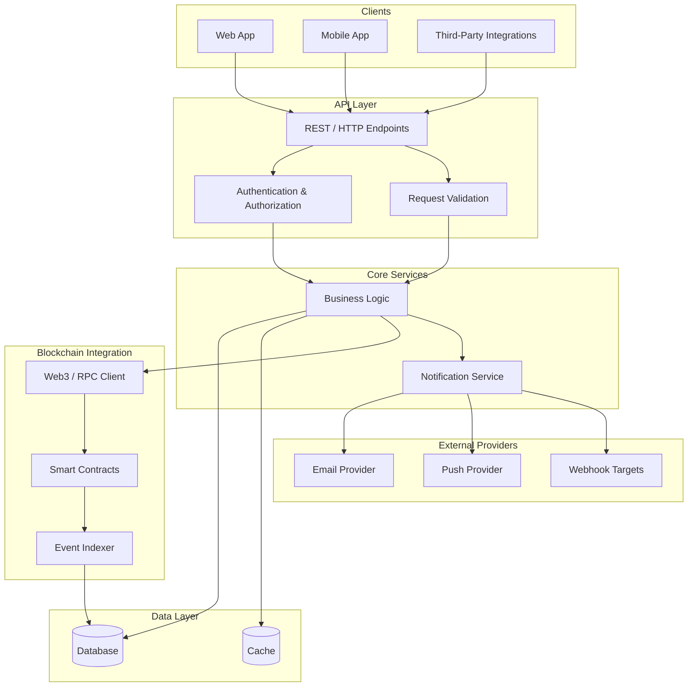
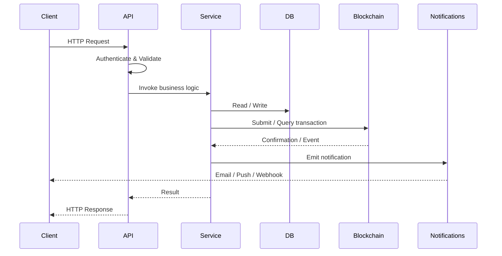

# System Architecture

This document provides a visual overview of the system architecture, covering the
API layer, blockchain integration, database, and notification subsystems.

## High-Level Overview

## Components

### API Layer
- **REST / HTTP Endpoints** — Public entry points for clients and integrations.
- **Authentication & Authorization** — Verifies caller identity and permissions.
- **Request Validation** — Ensures incoming payloads conform to expected schemas.

### Core Services
- **Business Logic** — Orchestrates domain operations and coordinates other subsystems.
- **Notification Service** — Dispatches user-facing and system notifications.

### Blockchain Integration
- **Web3 / RPC Client** — Communicates with blockchain nodes.
- **Smart Contracts** — On-chain logic invoked by the application.
- **Event Indexer** — Listens for on-chain events and persists relevant state.

### Data Layer
- **Database** — Primary persistent store for application and indexed data.
- **Cache** — Speeds up frequently accessed reads.

### External Providers
- **Email / Push / Webhook Targets** — Delivery channels used by the notification service.

## Request Flow

